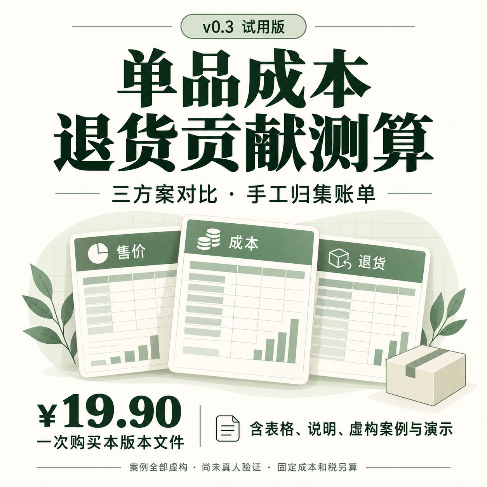
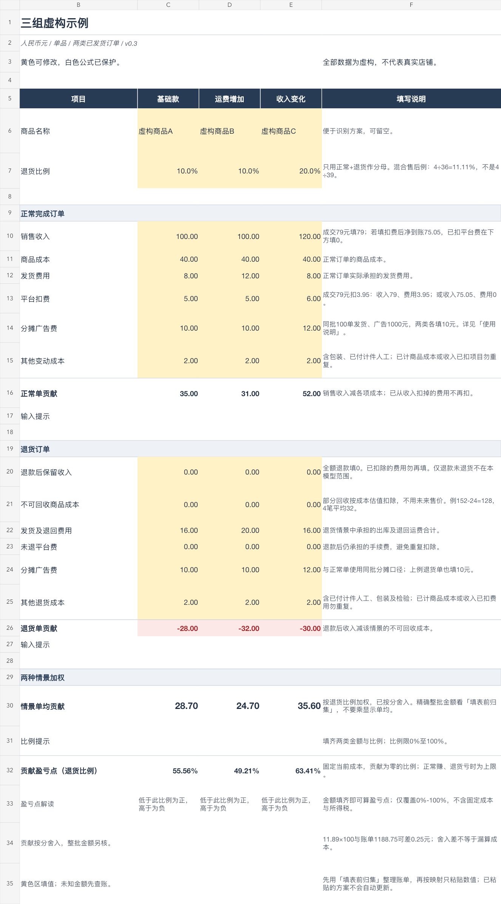

# 单品成本与退货贡献测算表

我正在制作面向小店经营者的电脑表格与使用说明，帮助把同款商品、售后已结束的一批订单分成正常完成与退货两类，归集成本并比较三套方案。当前版本为 **v0.3试用版**。

## 创作者与购买入口

本项目由北风整理与维护。我的爱发电主页：**https://afdian.com/a/beifengshoptools**。

爱发电用于提供本版本数字文件及商品说明约定的填写帮助。当前商品还在准备阶段，未上架；价格与交付信息以商品正式页面为准。本仓库用于展示创作内容和接受反馈。

## 作品预览

上图为实际工作簿中的示例页。黄色输入区可编辑，四张工作表包括使用说明、场景测算、虚构示例和填表前归集。公式区采用无密码保护以减少误改。

## 计算口径与使用流程

1. 同款商品、同一批次，先确认售后结束，再做互斥分类。
2. 分开归集正常完成与退货的最终收入、商品净成本、运费、平台费、广告和其他变动费用。
3. 归集页换算两类每单金额，再只粘贴数值到场景页。
4. 三套场景可分别调整价格和成本；归集修改后需重新粘贴，场景不会自动刷新。

加权单均贡献 = 正常单贡献 × (1 − 退货比例) + 退货单贡献 × 退货比例。模型分母只包含正常与退货两类；未发货取消、仅退款未退货和换货需另算。

精确模型内整批贡献以原始归集总额计算；显示单均按分舍入，不能乘订单数反推精确整批金额。回收商品按有依据的可回收成本估值，不能当现金入账。

## v0.3创作改进

- 新增账单总额到两类单均值的归集页。
- 增加混合售后分母说明和分类数量校验。
- 补充已付计件人工、自有劳动与部分回收成本的口径示例。
- 说明显示舍入与整批贡献之间的差额。

## AI模拟案例与验证范围

模拟保温杯批次有24笔虚构记录，其中18正常、3退货进入模型，共21笔。原价89元的模型内整批贡献489.53元；在订单数量、结构和其他费用假设不变时，84元方案为404.18元。此例不证明降价会改变真实销量。

本地完成43项工作簿结构与账单复核，逐单重算24笔虚构CSV并核对29项结果；macOS WPS进行过部分实际输入、保存和数值粘贴检查。Microsoft Excel、Windows WPS和其他软件版本尚未实测。

**订单、金额、费率及角色反馈均由AI构造。尚未完成真人试填或支付意愿验证，不代表真实店铺收益或真人满意度。**

结果为订单贡献，固定成本、税、自有劳动估值及现金流需另算，不能直接解释为店铺净利润。模板不自动导入平台账单或判断广告归因。

## 反馈

欢迎通过Issues说明使用软件、版本、操作步骤、预期和实际结果，优先提供虚构金额或脱敏最小复现。请勿提交真实客户信息或完整非公开店铺账单。

## 使用权限

本页文字与预览用于介绍作品。完整文件的购买者使用范围以对应交付说明为准；本展示仓库未添加开源许可证，也未授权转卖或公开分发完整模板。
